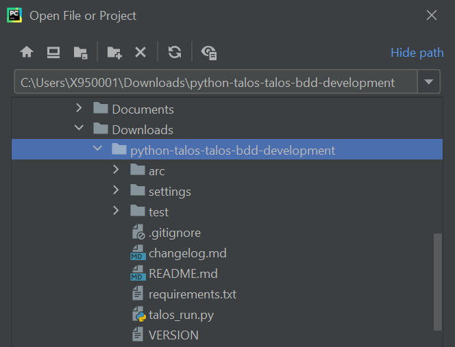
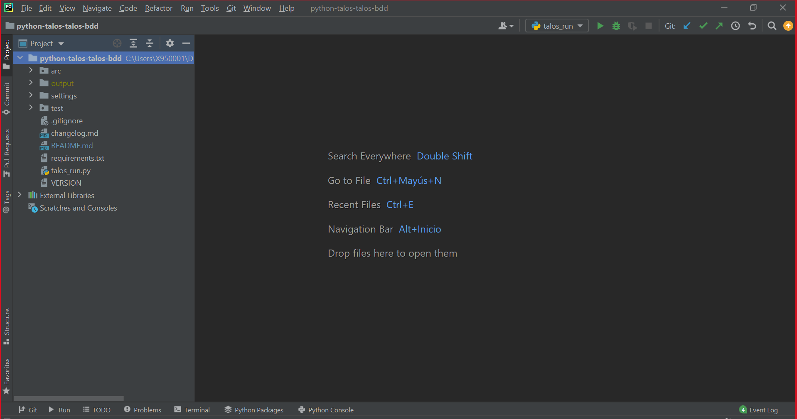
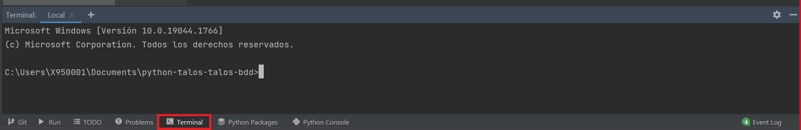
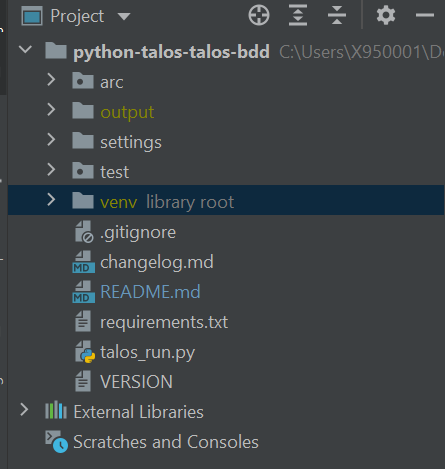
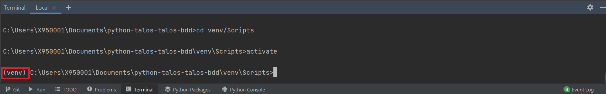
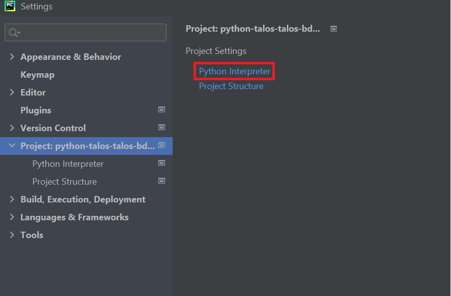
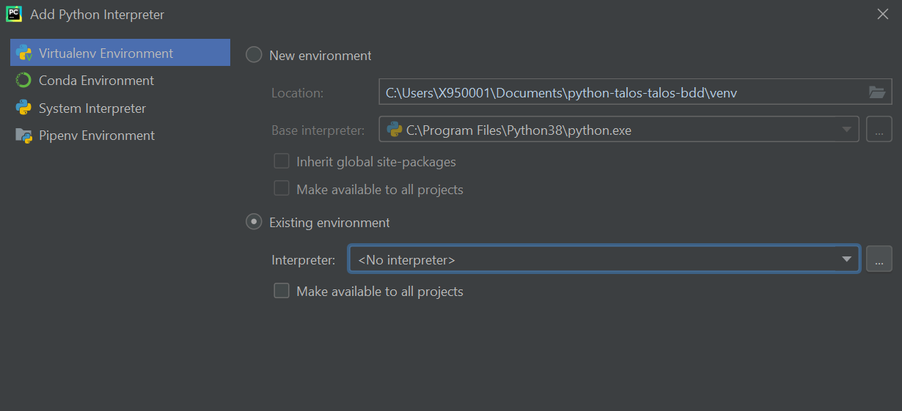
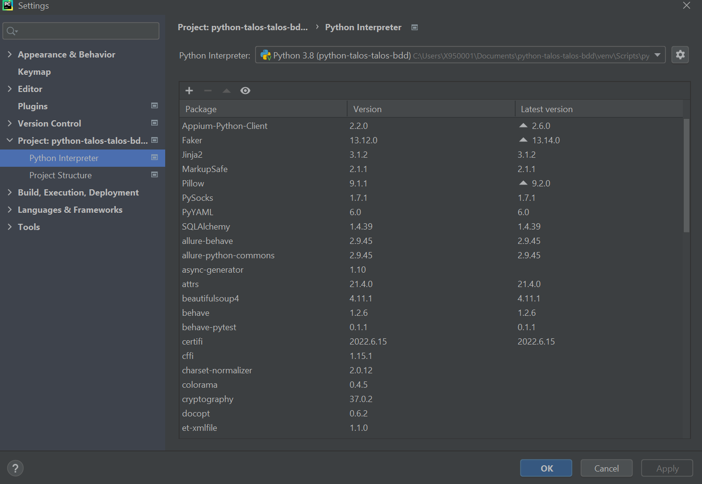
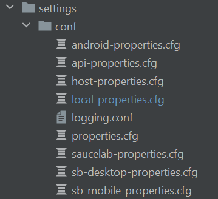

#  TALOS BDD Automation Framework

## Testar uma URL no Windows

Abra PowerShell na pasta do projeto, instale Python 3.12 e Chrome e execute:

```powershell
py -3.12 -m venv .venv
.\.venv\Scripts\python.exe -m pip install -r requirements.txt
.\.venv\Scripts\python.exe -m dashboard.app
```

Abra `http://127.0.0.1:5050/`, informe a URL
`https://controle-vendas-shopee.rsouzafrancisco82.chatgpt.site/`, selecione
**Todas as abas** ou uma aba e clique em **Executar testes**. Use **Mostrar
Chrome** para acompanhar a navegação. Os cenários verificam títulos visíveis
de Painel, Vendas, Estoque e Investimentos, sem cadastrar, alterar ou excluir
dados reais. Relatórios dependem da execução real; nenhum resultado é gerado
como demonstração.

O painel Flask local usa o mesmo visual da prévia publicada no Work; os controles
de execução BDD aparecem somente na versão local. Se você substituir um pacote
anterior, encerre o servidor com `Ctrl+C`, extraia este ZIP em uma pasta nova e
recarregue o navegador com `Ctrl+F5` após reiniciar o servidor.

Também é possível executar sem o painel:

```powershell
$env:AUTOMACAO_TARGET_URL = 'https://controle-vendas-shopee.rsouzafrancisco82.chatgpt.site/'
.\.venv\Scripts\python.exe talos_run.py --tags @shopee_pages -D Config_environment=chrome-ci --no-alm
```

Use `@shopee_panel`, `@shopee_sales`, `@shopee_stock` ou
`@shopee_investments` para escolher só uma aba. O teste das abas não valida
cálculos, criação de registros ou regras de negócio. Em ambientes que pedem
login, configure antes uma conta dedicada a testes.

> A framework developed and supported by the ***Testing Automation CoE - Automation Toolkit***

**TALOSBDD** is a [Python](https://devdocs.io/python~3.6/) test automation framework based on the BDD development
methodology. Uses a Gherkin language layer for automated test case development. It allows the automation of functional
tests web, mobile, API, FTP, among others, in a simple, fast and easy maintenance way.

**You can find more information and documentation in the Confluence space of
the [Automation Toolkit](https://confluence.alm.europe.cloudcenter.corp/display/QUASER/TALOS+BDD)**

----

## Table of Contents

1. [About TALOSBDD](#about-talosbdd)
2. [Requirements](#requirements)
3. [How to download TALOS BDD](#how-to-download-talos-bdd)
    - [Download mode](#download-mode)
4. [How to install](#how-to-install)
5. [Folder structure](#folder-structure)
6. [TALOSBDD settings](#talosbdd-settings)
    - [TALOSBDD config](#talosbdd-config)
    - [Run configuration](#run-configuration)
    - [TALOSBDD arguments](#talosbdd-arguments)
7. [How to run the framework](#how-to-run-the-framework)
    - [Through the IDE](#through-the-ide)
    - [By Command Line](#by-command-line)
8. [Handle sensible data](#handle-sensible-data)

----

## About TALOSBDD

TALOS BDD is based on open technologies to offer the necessary functionalities to automate your tests. Among these
technologies are:

- [Behave](https://behave.readthedocs.io/en/latest/)
- [Selenium](https://www.seleniumhq.org/docs/)
- [Appium](http://appium.io/docs/en/about-appium/intro/)
- [Request](https://requests.readthedocs.io/en/master/)
- [Records](https://pypi.org/project/records/)
- [Pillow](https://pillow.readthedocs.io/en/stable/)
- [Pytest](https://docs.pytest.org/en/stable/contents.html)

**TALOSBDD** is an all-terrain Framework:

- **Multi-platform**
    - Allows execution in Windows, Linux and Mac environments
- **Multi-functional**
    - It allows automating functional tests Web, Mobile, microservices, FTP, Database, etc.
- **Multi-device**
    - Allows execution in all browsers, headless, Android and iOS mobile devices, virtualization, local devices and in
      the cloud
- **Multi-environments**
    - Allows easy data management between business environments

----

## Requirements

- [Python 3.7+ 64 bits](https://www.python.org/downloads/release/python-370/)
- [PyCharm](https://www.jetbrains.com/es-es/pycharm/) as a highly recommended IDE

----

## How to download TALOS BDD

**TALOSBDD** is managed by the Automation Toolkit team, so its use is upon request to the CoE Automation Testing.

### Download mode

1. Go to TALOSBDD Github repository and do a clone or download of the repository.
    - https://github.alm.europe.cloudcenter.corp/sgt-talos/python-talos-talos-bdd
2. Request access to the **TALOS Automation Framework Teams** group and in the "Files" tab in the "TALOS BDD" folder you
   can download a compressed file with the Framework binaries.
3. Contact the **CoE Automation Testing**, and you will be given a copy of the compressed file with the Framework.

----

## How to install

The installation of **TALOSBDD** is very simple, just open the project in your IDE and configure the virtual
environment that the framework brings with it. For this the following will be done:

> The following step guide will be done keeping in mind that you have selected PyCharm as your IDE. For the rest of the
> IDE, please find in its documentation how to configure the Python virtual environment.

1. #### Open PyCharm
2. #### In File \> Open... look for the path where I unzip the framework .zip
3. #### Make sure that in the previous step you have chosen as the parent folder the folder containing the framework files and folders.



4. #### Make sure you can see the following filesystem in the IDE



5. #### Wait for the IDE to index the project. At the bottom right of the framework a loading bar will appear indicating the indexing progress
   > Normally Pycharm automatically detects the virtual environment and identifies that the framework interpreter is in
   the "env" folder. If this does not happen, follow the next steps
6. #### Set up the virtual environment
    - Click on Terminal
      
    - Create a new venv typing:
    ```bash
    $ python -m venv venv
    ``` 
    - After the above step, the venv folder has been created in the project path
      
    - Type in terminal (required to activate the virtual environment):
    ```bash
    $ venv\Scripts\activate
    ``` 
    - Shall appear (venv) if is correctly activated
      
    - install now the requirements.txt typing:
      ```bash
      $ pip install -r requirements.txt
      ``` 
      > If you have any problems installing the dependency try configuring pip to connect to the nexus or run pip
      install through a proxy.
    - Go to File > Settings ...
    - Among the options on the right you will find the option "Project: [folder_name]", select this option
    - Select the "Python Interpreter" option
      
    - Select the nut to the right of the "Python Interpreter" field
    - Select the option "Add ..."
    - Make sure the "Virtualenv Environment" option on the left is selected and select the "Existing environment" radius
      button
    - Click on the button with the ellipsis (...) to the right of the "Interpreter" field
      
    - A file explorer will open, you must go to the project path and then go to venv \> Scripts and look for the
      Python.exe file, select it and click the OK button
    - Make sure that the "Interpreter" field shows the path of the Python.exe file that you just selected in the
      previous step
    - Press the OK button and if everything has gone well, the list of packages used by the framework will appear as it
      appears in the following image
      
    - Press the OK button again and let the IDE index all packages
    - If everything went well, the text "library root" will appear on the left of the "venv" folder in the IDE

----

## Folder structure

Within the **TALOSBDD** Framework you will find the following folders

- **arc -->** There are all the files related to the functionalities of the Framework. It is recommended **not to
  change** the content of this folder for a good functioning of the Framework and an easy version migration. All the
  changes you make in this folder **will be erased** in subsequent updates.
- **venv -->** In this folder are the virtual environment configuration and all the packages that the framework uses for
  its operation. **No file in this folder should be changed.**
- **test -->** Folder that contains everything related to the creation of the automation
    - **helpers -->** The "pageobject" and "apiobject" folders will be stored in this folder, its function is to house
      all the files that the developer needs to carry out his tests, in addition to the extra functionalities that he
      has to develop to carry out the particularities of his project.
        - **pageobject -->** Folder that stores the .py files related to the page objects of the automation of
          functional interface tests.
        - **apiobject -->** Folder stores all the .py files and other types of files that are needed to carry out the
          automation of microservices.
    - **features -->** In this folder all files with extension **.feature** will be stored.
    - **steps -->** folder that will contain all the files related to the Gherkin steps, in these .py format files you
      will find the declarations of the Gherkin verbs with their automation code.
- **settings -->** folder that has everything related to the **framework configuration**.
    - **conf -->** folder that contains all the execution type configuration properties files.
    - **profiles -->** folder containing the folders that simulate the runtime environments with their respective JSON
      and YAML files for test data management.
    - **drivers -->** folder containing the drivers of the different browsers
- **output -->** destination folder of the reports and files generated by the framework.

----

## TALOSBDD settings

### TALOSBDD config

All **TALOSBDD** configuration is centralized in the **settings.py** file in the "settings" folder.

~~~
""" PyTalos configurations """
# Project configurations
BASE_PATH = Path(__file__).absolute().parent.parent
SETTINGS_PATH = os.path.join(BASE_PATH, 'settings')
OUTPUT_PATH = os.path.join(BASE_PATH, 'output')

# Proxy configuration
PROXY = {
    'http_proxy': 'http://<your_proxy>:<port>',
    'https_proxy': 'http://<your_proxy>:<port>'
}

# Project and general configuration
PYTALOS_GENERAL = {
    'download_path': "path",
    'auto_generate_output_dir': True,
    'auto_generate_test_dir': True,
    'environment_proxy': {
        'enabled': False,
        'proxy': PROXY
    },
    'update_driver': {
        'enabled_update': False,
        'enable_proxy': False,
        'proxy': PROXY
    }
}

# Run configuration
PYTALOS_RUN = {
    'delete_old_reports': True,
    'close_webdriver': True,
    'close_host': True,
    'continue_after_failed_step': True,
    'default_steps_options': {
        "element_highlight_web": True,
    },
    'timeout': {
        'short': 10,
        'medium': 20,
        'long': 30
    },
    'execution_proxy': {
        'enabled': True,
        'proxy': PROXY
    },
}

# Reports configurations
PYTALOS_REPORTS = {
    'generate_html': True,
    'generate_simple_html': True,
    'generate_docx': True,
    'generate_txt': True,
    'generate_screenshot': True,
    'generate_extra_reports': True,

}

# Profile datas configurations
PYTALOS_PROFILES = {
    'environment': 'cer',
    'master_file': 'datas',
    'locale_fake_data': 'es_ES',
    'language': 'es'

}

# Step catalog configurations
PYTALOS_CATALOG = {
    'update_step_catalog': True,
    'excel_file_name': 'catalog',
    'steps': {
        'user_steps': False,
        'default_api': True,
        'default_web': True,
        'default_functional': True,
        'default_data': True,
        'default_ftp': True,
    }
}

""" Integrations """
# MF ALM integration configurations
PYTALOS_ALM = {
    'post_to_alm': True,
    'generate_json': True,
    'match_alm_execution': False,
    'alm3_properties': False,
}

# Jira integration configuration
PYTALOS_JIRA = {
    'post_to_jira': False,
    'username': 'user',
    'password': 'password',
    'base_url': 'https://jira.alm.europe.cloudcenter.corp',
    'report': {
        'comment_execution': True,
        'comment_scenarios': True,
        'upload_doc_evidence': True,
        'upload_txt_evidence': True,
        'upload_html_evidence': True,
    }
}

""" Behave configurations """
# BEHAVE configuration
BEHAVE = {
    'color': True,
    'junit': False,
    'default_format': 'pretty',
    'show_skipped': False,
    'show_multiline': True,
    'stdout_capture': False,
    'stderr_capture': False,
    'log_capture': True,
    'logging_level': 'INFO',
    'logging_clear_handlers': True,
    'summary': True,
    'show_source': True,
    'show_timings': True,
    'verbose': False,

}

""" BD Configurations"""
# SQLite configuration
SQLITE = {
    'enabled': False,
    'sqlite_home': os.path.join(BASE_PATH, 'db.sqlite3')
}
~~~

### Run configuration

The webdriver configurations can be found in the path: settings \> conf.
Inside this folder you will find files with cfg formats that represent different types or modes of execution.



The mode of use is very simple, you can create as many cfg configuration files as you want, taking into account the
mandatory naming of the file name:

`[config_name]-properties.cfg`

Where "config_name" is the variable name that you want to name the configuration file, and the rest are mandatory.

Within each configuration file of the execution we will see the following:

~~~
[Test]
url:

[Driver]
# Valid driver types: firefox, chrome, iexplore, edge, safari, opera, phantomjs, ios, android, api (no driver)
# edgeie (edge with ie compatibilities), host
type: edgeie
# Configure local driver paths
gecko_driver_path: geckodriver.exe
# linux
;chrome_driver_path: chromedriver
# windows
;chrome_driver_path: chromedriver.exe
chrome_driver_path: chromedriver101.exe
explorer_driver_path: IEDriverServer.exe
edge_driver_path: msedgedriver.exe
opera_driver_path:
phantomjs_driver_path:
# Browser size and bounds
window_width:
window_height:
monitor:
bounds_x: 3000
bounds_y: 0
# Driver options
implicitly_wait: 20
explicitly_wait: 25
reuse_driver: false
reuse_driver_session: false
restart_driver_after_failure: true
save_web_element: false
appium_app_strings: false
headless = false
proxy = false

[ChromePreferences]
download.default_directory: downloads

[ChromeArguments]
# required for docker
no-sandbox: true
disable-gpu: true
disable-dev-shm-usage: true


;[FirefoxPreferences]
;devtools.netmonitor.har.enableAutoExportToFile: True
;devtools.netmonitor.har.defaultLogDir: /tmp/har
;devtools.netmonitor.har.forceExport: False
;devtools.netmonitor.har.pageLoadedTimeout: 10
;extensions.netmonitor.har.enableAutomation: True
;extensions.netmonitor.har.autoConnect: True
;devtools.netmonitor.har.defaultFileName: network-test

[Capabilities]
;# Selenium capabilities: https://github.com/SeleniumHQ/selenium/wiki/DesiredCapabilities
acceptSslCerts: true

;[AppiumCapabilities]
# Appium capabilities: http://appium.io/slate/en/master/?ruby#appium-server-capabilities

;[Server]
;enabled: false
;host:
;port:
;video_enabled: false
;logs_enabled: false
~~~

> You can also use the sections of [FirefoxPreference] and the other browsers to configure the preferences, and the
> arguments you need.


> For the automation of microservices tests, it is enough just to indicate that the Type is api type, since it is not
> necessary to raise webdriver or any other previous configuration

In the same file you can also use the [Capabilities] and [AppiumCapabilities] sections for executions on mobile devices.

**TALOSBDD** comes with several configuration files as examples so that you can modify at will depending on what you
need to do.

For more information you can check the following links:

- [Capabilities](https://www.selenium.dev/documentation/legacy/desired_capabilities/)
- [AppiumCapabilities](http://appium.io/docs/en/2.0/guides/caps/)
- [Capabilities and ChromeOptions](https://chromedriver.chromium.org/capabilities)
- [FirefoxPreference](https://developer.mozilla.org/en-US/docs/Web/WebDriver/Capabilities/firefoxOptions)

----

## TALOSBDD arguments

The following arguments are available to be run in the terminal as in the example below:

~~~
python talos_run.py -h or python talos_run.py --help
~~~

~~~
-h, --help            show this help message and exit
-c, --no-color        Disable the use of ANSI color escapes.
--color               Use ANSI color escapes. This is the default behaviour. This switch is used to override a configuration file setting.
-d, --dry-run         Invokes formatters without executing the steps.
-D NAME=VALUE, --define NAME=VALUE
					Define user-specific data for the config.userdata dictionary. Example: -D foo=bar to store it in config.userdata["foo"].
-e PATTERN, --exclude PATTERN
					Don't run feature files matching regular expression PATTERN.
-i PATTERN, --include PATTERN
					Only run feature files matching regular expression PATTERN.
--no-junit            Don't output JUnit-compatible reports.
--junit               Output JUnit-compatible reports. When junit is enabled, all stdout and stderr will be redirected and dumped to the junit report,
					regardless of the "--capture" and "--no-capture" options.
--junit-directory PATH
					Directory in which to store JUnit reports.
-f FORMAT, --format FORMAT
					Specify a formatter. If none is specified the default formatter is used. Pass "--format help" to get a list of available
					formatters.
--steps-catalog       Show a catalog of all available step definitions. SAME AS: --format=steps.catalog --dry-run --no-summary -q
-k, --no-skipped      Don't print skipped steps (due to tags).
--show-skipped        Print skipped steps. This is the default behaviour. This switch is used to override a configuration file setting.
--no-snippets         Don't print snippets for unimplemented steps.
--snippets            Print snippets for unimplemented steps. This is the default behaviour. This switch is used to override a configuration file
					setting.
-m, --no-multiline    Don't print multiline strings and tables under steps.
--multiline           Print multiline strings and tables under steps. This is the default behaviour. This switch is used to override a configuration
					file setting.
-n NAME, --name NAME  Only execute the feature elements which match part of the given name. If this option is given more than once, it will match
					against all the given names.
--no-capture          Don't capture stdout (any stdout output will be printed immediately.)
--capture             Capture stdout (any stdout output will be printed if there is a failure.) This is the default behaviour. This switch is used to
					override a configuration file setting.
--no-capture-stderr   Don't capture stderr (any stderr output will be printed immediately.)
--capture-stderr      Capture stderr (any stderr output will be printed if there is a failure.) This is the default behaviour. This switch is used to
					override a configuration file setting.
--no-logcapture       Don't capture logging. Logging configuration will be left intact.
--logcapture          Capture logging. All logging during a step will be captured and displayed in the event of a failure. This is the default
					behaviour. This switch is used to override a configuration file setting.
--logging-level LOGGING_LEVEL
					Specify a level to capture logging at. The default is INFO - capturing everything.
--logging-format LOGGING_FORMAT
					Specify custom format to print statements. Uses the same format as used by standard logging handlers. The default is
					"%(levelname)s:%(name)s:%(message)s".
--logging-datefmt LOGGING_DATEFMT
					Specify custom date/time format to print statements. Uses the same format as used by standard logging handlers.
--logging-filter LOGGING_FILTER
					Specify which statements to filter in/out. By default, everything is captured. If the output is too verbose, use this option to
					filter out needless output. Example: --logging-filter=foo will capture statements issued ONLY to foo or foo.what.ever.sub but not
					foobar or other logger. Specify multiple loggers with comma: filter=foo,bar,baz. If any logger name is prefixed with a minus, eg
					filter=-foo, it will be excluded rather than included.
--logging-clear-handlers
					Clear all other logging handlers.
--no-summary          Don't display the summary at the end of the run.
--summary             Display the summary at the end of the run.
-o FILE, --outfile FILE
					Write to specified file instead of stdout.
-q, --quiet           Alias for --no-snippets --no-source.
-s, --no-source       Don't print the file and line of the step definition with the steps.
--show-source         Print the file and line of the step definition with the steps. This is the default behaviour. This switch is used to override a
					configuration file setting.
--stage STAGE         Defines the current test stage. The test stage name is used as name prefix for the environment file and the steps directory
					(instead of default path names).
--stop                Stop running tests at the first failure.
-t TAG_EXPRESSION, --tags TAG_EXPRESSION
					Only execute features or scenarios with tags matching TAG_EXPRESSION. Pass "--tags-help" for more information.
-T, --no-timings      Don't print the time taken for each step.
--show-timings        Print the time taken, in seconds, of each step after the step has completed. This is the default behaviour. This switch is used
					to override a configuration file setting.
-v, --verbose         Show the files and features loaded.
-w, --wip             Only run scenarios tagged with "wip". Additionally: use the "plain" formatter, do not capture stdout or logging output and stop
					at the first failure.
-x, --expand          Expand scenario outline tables in output.
--lang LANG           Use keywords for a language other than English.
--lang-list           List the languages available for --lang.
--lang-help LANG      List the translations accepted for one language.
--tags-help           Show help for tag expressions.
--version             Show version.
-p PROXY, --proxy PROXY
					Provides a proxy for execution.
-ep ENV_PROXY, --env_proxy ENV_PROXY
					Provides a environment proxy for execution.
-env ENVIRONMENT, --environment ENVIRONMENT
					Provide the name of the environment for the profile data.
-lk, --laika          Enable Laika integration.
--no-alm              Disable all ALM configurations
~~~

## How to run the framework

To run the framework we have three ways:

### Through the IDE

Having configured the virtual environment of the **TALOSBDD** as shown in the previous steps, just run the **
talos_run.py** file.

The talos_run.py file has the following launch settings.

~~~
runner.main(make_behave_argv(
        conf_properties='local',
        tags=['tag']
    ))
~~~

Where in the **"conf_properties"** attribute we can indicate the name of the **configuration file** that we want to use
for the launch (just put the name before "-properties.cfg", this part being unnecessary).

In the **"tags"** attribute we can send you a list of the **tags used in the Gherkin** of the features files to indicate
which scenarios we want to execute.
> To run the talos_run.py file in the PyCharm IDE, just right-click it and select the option "Run talos_run"

### By Command Line

**TALOSBDD** allows execution by commands, for that we can also use the behave_run.py file that allows the introduction
of command arguments

```bash
$ Python talos_run.py [behave arguments]
```

An example of command line execution would be:

```bash
$ python talos_run.py --tags @third_exec -D Config_environment='api'
```

> In [Behave documentation](https://behave.readthedocs.io/en/stable/behave.html) you can find the arguments that you
> support the TALOSBDD framework

## Handle sensible data

In order to upload passwords and sensible data to GitHub you need to encrypt your data.
For to encode and decode functions you need to pass a passphrase in order to encrypt the data.
You can pass that passphrase manually or just create a file named .env in the root folder with this content:
If you are going to use an .env file, it must be at the root of the project and the variable key must be PASSPHRASE
mandatorily.
The .env file must not be uploaded to GitHub. The file is added to the .gitignore file.
Also you can use the .env to store any data you need in the future.

> The passphrase must have ALWAYS a length of 16 characters.

````bash
PASSPHRASE = QWERTYUIOPASDFGH
````

````python
import os
from arc.contrib.tools.crypto.crypto import encode, decode

text = "My text"  # manual way
text = os.environ.get('PASSPHRASE') # .env or system environment variable way

# You can pass a passphrase to the encode and decode function but by default, use the passphrase stored in the environment variables.
encrypted_text = encode(text)

decrypted_text = decode(encrypted_text)

````

The only secure method is the first encryption method which need of a passphrase.
This method is compatible by example with Laika.
If you need to execute this in Jenkins you need to make sure you set up the PASSPHRASE environment variable.

> REMEMBER: If you forget the passphrase you will not be able to recover your encrypted data.
